README
================
2022-12-14

### The final project PDF can be viewed [HERE](https://github.com/TianCater/ATS_BVAR_Project_19025831/blob/main/19025831/19025831.pdf) in the repo above.

# Purpose

The purpose of this README is to provide a sanitized workflow for my
Advanced Time Series Econometrics 871 project, entailing estimating
Bayesian Vector Auto-Regression model.

[a link](https://github.com/TianCater/FinMetrics871_Project)

``` r
pacman::p_load(BVAR, fredr, purrr, dplyr, writexl, tidyr, ggplot2, fmxdat, lubridate)

fred_api_key <- fredr_set_key("d3c88549b884b18ff71b2541742bd179")

fredr_has_key()
```

    ## [1] TRUE

# Data Import and Cleaning

I start by importing the required data using the handy fredr package:

``` r
NGDP <- fredr(                         # Nominal, Dollars, Not Seasonally Adjusted, per capita
  series_id = "A939RC0A052NBEA"    # Start date: 1929-01-01
  
 ) |> select(date, value) |>      # Notice is (NOT) logged
    filter(date >= lubridate::ymd("19600101")) |> 
    rename( NGDP = value)


HEX <- fredr(series_id = "G160271A027NBEA") |>     # Start date: 1959-01-01 # Is in Billions of dollars 
    select(date, value) |>           # Notice is NOT logged
    filter(date >= lubridate::ymd("19600101")) |> 
        rename( HEX = value)


Population_total_thousands <- fredr(series_id = "B230RC0A052NBEA") |>    # Notice is in thousands  # Start date: 1929-01-01
    select(date, value) |> 
    filter(date >= lubridate::ymd("19600101")) |> 
        rename( Pop_T_Th = value)


LIFEE <-  fredr(series_id = "SPDYNLE00INUSA") |>  # Life expectancy at birth indicates the number of years a newborn infant would live if prevailing patterns of mortality at the time of its birth were to stay the same throughout its life.
    select(date, value) |>   # Start date: 1960-01-01
        rename( LIFEE = value)

    
Population_0_14 <- fredr(series_id = "SPPOP0014TOZSUSA") |>  # NOTE: The percent of total!
    filter(date >= lubridate::ymd("19600101")) |>  # Start date: 1960-01-01
    select(date, value) |> 
        rename( Pop_0_14 = value)


Population_65_plus <- fredr(series_id = "SPPOP65UPTOZSUSA") |>  # NOTE: The percent of total!
    filter(date >= lubridate::ymd("19600101")) |>   # Start date: 1960-01-01
    select(date, value) |> 
        rename( Pop_65_plus = value)
```

Now I merge the individual series and conduct some data wrangling:

``` r
merged_data <- inner_join(NGDP, HEX, by = "date") |> inner_join(Population_total_thousands, by ="date") |> 
    inner_join(LIFEE, by ="date") |> inner_join(Population_0_14, by ="date") |> 
    inner_join(Population_65_plus, by ="date")

df <- merged_data |> mutate(HEX_pc = HEX*1000000/(Pop_T_Th)) |>  # Note: I transform HEX from billions and population from thousands, and take the HEX per capita
    mutate(AI = Pop_65_plus*100/Pop_0_14) |> 
    select(date, NGDP, HEX_pc, LIFEE, AI) |> mutate(NGDP = log(NGDP), HEX_pc = log(HEX_pc))

df[59 ,3] <- 8.89 
df[60 ,3] <- 9.3 
df[61 ,3] <- 9.6 

df_logged <- df |> mutate(NGDP = log(NGDP), HEX_pc = log(HEX_pc), AI = log(AI))
```

# Visualising the data

``` r
ts_plot <- df |> pivot_longer(cols = -date, names_to = "Variable", values_to = "Value") |> 
    
    ggplot() +
    
    geom_line(aes(date, Value, color = Variable), size = 1, alpha = 0.7) +
    
    facet_wrap(~Variable, scales = "free_y") +
    
    
   fmxdat::theme_fmx(title.size = fmxdat::ggpts(30), 
                    subtitle.size = fmxdat::ggpts(0),
                    caption.size = fmxdat::ggpts(25),
                    CustomCaption = T) + 
    
  fmxdat::fmx_cols() + 
  
  labs(x = "", y = "", caption = "Note:\nCalculation own",
       title = "",
       subtitle = "")
    
# And finally touches with finplot    

fmxdat::finplot(ts_plot, x.vert = T, x.date.type = "%Y", x.date.dist = "4 years", darkcol = T)
```

    ## Scale for colour is already present.
    ## Adding another scale for colour, which will replace the existing scale.

<!-- -->

``` r
ts_plot_logged <- df_logged |> pivot_longer(cols = -date, names_to = "Variable", values_to = "Value") |> 
    
    ggplot() +
    
    geom_line(aes(date, Value, color = Variable), size = 1, alpha = 0.7) +
    
    facet_wrap(~Variable, scales = "free_y") +
    
    
   fmxdat::theme_fmx(title.size = fmxdat::ggpts(30), 
                    subtitle.size = fmxdat::ggpts(0),
                    caption.size = fmxdat::ggpts(25),
                    CustomCaption = T) + 
    
  fmxdat::fmx_cols() + 
  
  labs(x = "", y = "", caption = "Note:\nCalculation own",
       title = "",
       subtitle = "")


# And finally touches with finplot    

fmxdat::finplot(ts_plot_logged, x.vert = T, x.date.type = "%Y", x.date.dist = "4 years", darkcol = T)
```

    ## Scale for colour is already present.
    ## Adding another scale for colour, which will replace the existing scale.

<!-- -->

Some summary statistics:

``` r
summary(df)
```

    ##       date                 NGDP            HEX_pc          LIFEE      
    ##  Min.   :1960-01-01   Min.   : 8.007   Min.   :3.411   Min.   :69.77  
    ##  1st Qu.:1975-01-01   1st Qu.: 8.962   1st Qu.:5.444   1st Qu.:72.60  
    ##  Median :1990-01-01   Median :10.079   Median :6.886   Median :75.21  
    ##  Mean   :1989-12-31   Mean   : 9.814   Mean   :6.576   Mean   :74.85  
    ##  3rd Qu.:2005-01-01   3rd Qu.:10.693   3rd Qu.:7.861   3rd Qu.:77.49  
    ##  Max.   :2020-01-01   Max.   :11.077   Max.   :9.600   Max.   :78.84  
    ##        AI       
    ##  Min.   :29.95  
    ##  1st Qu.:41.60  
    ##  Median :56.89  
    ##  Mean   :53.62  
    ##  3rd Qu.:59.97  
    ##  Max.   :87.64

# Initial Bayesian VAR estimation using BVAR

``` r
mn <- bv_minnesota(
    lambda = bv_lambda(mode = 10, sd = 0.3, min = 0.0001, max = 5),
    alpha = bv_alpha(mode =2, sd = 0.3, min = 0.0001, max = 5),
    psi = bv_psi(scale = 0.004, shape = 0.004, mode = c(9.8,6.5,74,54)),
    var = 1e07
)


 soc <- bv_soc(mode = 1, sd = 1, min = 1e-04, max = 50)
 sur <- bv_sur(mode = 1, sd = 1, min = 1e-04, max = 50)

priors <- bv_priors(hyper = "auto", mn = mn, sur = sur)

priors_app <- bv_priors(mn = bv_mn(b = 0))

mh <- bv_metropolis( 
                    adjust_acc = TRUE, 
                    acc_lower = 0.25, 
                    acc_upper = 0.45)

run <- bvar(df_logged |> select(-date), 
            lags = 1, 
            n_draw = 50000, 
            priors = priors, 
            mh = mh, verbose = TRUE)
```

    ## Optimisation concluded.
    ## Posterior marginal likelihood: -425.854
    ## Hyperparameters: lambda = 5; sur = 0.23472
    ##   |                                                                              |                                                                      |   0%  |                                                                              |                                                                      |   1%  |                                                                              |=                                                                     |   1%  |                                                                              |=                                                                     |   2%  |                                                                              |==                                                                    |   2%  |                                                                              |==                                                                    |   3%  |                                                                              |==                                                                    |   4%  |                                                                              |===                                                                   |   4%  |                                                                              |===                                                                   |   5%  |                                                                              |====                                                                  |   5%  |                                                                              |====                                                                  |   6%  |                                                                              |=====                                                                 |   6%  |                                                                              |=====                                                                 |   7%  |                                                                              |=====                                                                 |   8%  |                                                                              |======                                                                |   8%  |                                                                              |======                                                                |   9%  |                                                                              |=======                                                               |   9%  |                                                                              |=======                                                               |  10%  |                                                                              |=======                                                               |  11%  |                                                                              |========                                                              |  11%  |                                                                              |========                                                              |  12%  |                                                                              |=========                                                             |  12%  |                                                                              |=========                                                             |  13%  |                                                                              |=========                                                             |  14%  |                                                                              |==========                                                            |  14%  |                                                                              |==========                                                            |  15%  |                                                                              |===========                                                           |  15%  |                                                                              |===========                                                           |  16%  |                                                                              |============                                                          |  16%  |                                                                              |============                                                          |  17%  |                                                                              |============                                                          |  18%  |                                                                              |=============                                                         |  18%  |                                                                              |=============                                                         |  19%  |                                                                              |==============                                                        |  19%  |                                                                              |==============                                                        |  20%  |                                                                              |==============                                                        |  21%  |                                                                              |===============                                                       |  21%  |                                                                              |===============                                                       |  22%  |                                                                              |================                                                      |  22%  |                                                                              |================                                                      |  23%  |                                                                              |================                                                      |  24%  |                                                                              |=================                                                     |  24%  |                                                                              |=================                                                     |  25%  |                                                                              |==================                                                    |  25%  |                                                                              |==================                                                    |  26%  |                                                                              |===================                                                   |  26%  |                                                                              |===================                                                   |  27%  |                                                                              |===================                                                   |  28%  |                                                                              |====================                                                  |  28%  |                                                                              |====================                                                  |  29%  |                                                                              |=====================                                                 |  29%  |                                                                              |=====================                                                 |  30%  |                                                                              |=====================                                                 |  31%  |                                                                              |======================                                                |  31%  |                                                                              |======================                                                |  32%  |                                                                              |=======================                                               |  32%  |                                                                              |=======================                                               |  33%  |                                                                              |=======================                                               |  34%  |                                                                              |========================                                              |  34%  |                                                                              |========================                                              |  35%  |                                                                              |=========================                                             |  35%  |                                                                              |=========================                                             |  36%  |                                                                              |==========================                                            |  36%  |                                                                              |==========================                                            |  37%  |                                                                              |==========================                                            |  38%  |                                                                              |===========================                                           |  38%  |                                                                              |===========================                                           |  39%  |                                                                              |============================                                          |  39%  |                                                                              |============================                                          |  40%  |                                                                              |============================                                          |  41%  |                                                                              |=============================                                         |  41%  |                                                                              |=============================                                         |  42%  |                                                                              |==============================                                        |  42%  |                                                                              |==============================                                        |  43%  |                                                                              |==============================                                        |  44%  |                                                                              |===============================                                       |  44%  |                                                                              |===============================                                       |  45%  |                                                                              |================================                                      |  45%  |                                                                              |================================                                      |  46%  |                                                                              |=================================                                     |  46%  |                                                                              |=================================                                     |  47%  |                                                                              |=================================                                     |  48%  |                                                                              |==================================                                    |  48%  |                                                                              |==================================                                    |  49%  |                                                                              |===================================                                   |  49%  |                                                                              |===================================                                   |  50%  |                                                                              |===================================                                   |  51%  |                                                                              |====================================                                  |  51%  |                                                                              |====================================                                  |  52%  |                                                                              |=====================================                                 |  52%  |                                                                              |=====================================                                 |  53%  |                                                                              |=====================================                                 |  54%  |                                                                              |======================================                                |  54%  |                                                                              |======================================                                |  55%  |                                                                              |=======================================                               |  55%  |                                                                              |=======================================                               |  56%  |                                                                              |========================================                              |  56%  |                                                                              |========================================                              |  57%  |                                                                              |========================================                              |  58%  |                                                                              |=========================================                             |  58%  |                                                                              |=========================================                             |  59%  |                                                                              |==========================================                            |  59%  |                                                                              |==========================================                            |  60%  |                                                                              |==========================================                            |  61%  |                                                                              |===========================================                           |  61%  |                                                                              |===========================================                           |  62%  |                                                                              |============================================                          |  62%  |                                                                              |============================================                          |  63%  |                                                                              |============================================                          |  64%  |                                                                              |=============================================                         |  64%  |                                                                              |=============================================                         |  65%  |                                                                              |==============================================                        |  65%  |                                                                              |==============================================                        |  66%  |                                                                              |===============================================                       |  66%  |                                                                              |===============================================                       |  67%  |                                                                              |===============================================                       |  68%  |                                                                              |================================================                      |  68%  |                                                                              |================================================                      |  69%  |                                                                              |=================================================                     |  69%  |                                                                              |=================================================                     |  70%  |                                                                              |=================================================                     |  71%  |                                                                              |==================================================                    |  71%  |                                                                              |==================================================                    |  72%  |                                                                              |===================================================                   |  72%  |                                                                              |===================================================                   |  73%  |                                                                              |===================================================                   |  74%  |                                                                              |====================================================                  |  74%  |                                                                              |====================================================                  |  75%  |                                                                              |=====================================================                 |  75%  |                                                                              |=====================================================                 |  76%  |                                                                              |======================================================                |  76%  |                                                                              |======================================================                |  77%  |                                                                              |======================================================                |  78%  |                                                                              |=======================================================               |  78%  |                                                                              |=======================================================               |  79%  |                                                                              |========================================================              |  79%  |                                                                              |========================================================              |  80%  |                                                                              |========================================================              |  81%  |                                                                              |=========================================================             |  81%  |                                                                              |=========================================================             |  82%  |                                                                              |==========================================================            |  82%  |                                                                              |==========================================================            |  83%  |                                                                              |==========================================================            |  84%  |                                                                              |===========================================================           |  84%  |                                                                              |===========================================================           |  85%  |                                                                              |============================================================          |  85%  |                                                                              |============================================================          |  86%  |                                                                              |=============================================================         |  86%  |                                                                              |=============================================================         |  87%  |                                                                              |=============================================================         |  88%  |                                                                              |==============================================================        |  88%  |                                                                              |==============================================================        |  89%  |                                                                              |===============================================================       |  89%  |                                                                              |===============================================================       |  90%  |                                                                              |===============================================================       |  91%  |                                                                              |================================================================      |  91%  |                                                                              |================================================================      |  92%  |                                                                              |=================================================================     |  92%  |                                                                              |=================================================================     |  93%  |                                                                              |=================================================================     |  94%  |                                                                              |==================================================================    |  94%  |                                                                              |==================================================================    |  95%  |                                                                              |===================================================================   |  95%  |                                                                              |===================================================================   |  96%  |                                                                              |====================================================================  |  96%  |                                                                              |====================================================================  |  97%  |                                                                              |====================================================================  |  98%  |                                                                              |===================================================================== |  98%  |                                                                              |===================================================================== |  99%  |                                                                              |======================================================================|  99%  |                                                                              |======================================================================| 100%
    ## Finished MCMC after 24.8 secs.

``` r
# Run 1: with 2 lags, and soc and sur included, no covid dummy, 50 000 drwas------>   acc rate 0.188, need more draws maybe. All residual plots converge excepts Residuals AI. Fkorecasts/ Predictions looks okay. IRF's NOTHING. 

# Run 2: Same as above but with 250 000 draws -----> same acc rate. Clearer density of hyperparameters. Same residual plots. Pediction less average. NO IRFs

# Run 3: lag 1 --> Acc rate: 23.3%   .Still no bloody IRF?? Is the shock a one standard deviation shock? Where do I adjust that? 

# Run 4: Remove the SUR from priors. ACC rate 25.3% .  IRFs looks marginally better, but still not good.

# Run 5 : Now only remove SOC and include SUR. LAMBDA COEFFIECIENT IS ALREADY MUCH SMALLER. ACC rate 26.6%. AI AR(1) coefficient is larger than 1. Maybe make lag 2?  Over a 10 year HORIZON, the IRF's Do look a bit better!!!!!!!!!!

# Run 6 : None of the SOC or SUR. Acc rate 0.932 (WAY TOO HIGH)


########## SO FAR RUN 5 WAS THE BEST FOR SURE, LETS LOG TRANSFORM HEX AND NGDP 
```

``` r
print(run)
```

    ## Bayesian VAR consisting of 60 observations, 4 variables and 1 lags.
    ## Time spent calculating: 24.8 secs
    ## Hyperparameters: lambda, sur 
    ## Hyperparameter values after optimisation: 5, 0.23472
    ## Iterations (burnt / thinning): 50000 (5000 / 1)
    ## Accepted draws (rate): 14389 (0.32)

``` r
summary(run)
```

    ## Bayesian VAR consisting of 60 observations, 4 variables and 1 lags.
    ## Time spent calculating: 24.8 secs
    ## Hyperparameters: lambda, sur 
    ## Hyperparameter values after optimisation: 5, 0.23472
    ## Iterations (burnt / thinning): 50000 (5000 / 1)
    ## Accepted draws (rate): 14389 (0.32)
    ## 
    ## Numeric array (dimensions 5, 4) of coefficient values from a BVAR.
    ## Median values:
    ##               NGDP HEX_pc  LIFEE     AI
    ## constant     0.114  0.286  4.344  0.178
    ## NGDP-lag1    1.005  0.004  0.163 -0.004
    ## HEX_pc-lag1  0.015  1.035  0.658  0.037
    ## LIFEE-lag1  -0.002 -0.005  0.926 -0.003
    ## AI-lag1      0.003  0.006 -0.068  1.003
    ## 
    ## Numeric array (dimensions 4, 4) of variance-covariance values from a BVAR.
    ## Median values:
    ##         NGDP HEX_pc LIFEE    AI
    ## NGDP   0.155  0.000 0.000 0.000
    ## HEX_pc 0.000  0.103 0.000 0.000
    ## LIFEE  0.000  0.000 1.248 0.000
    ## AI     0.000  0.000 0.000 0.852
    ## 
    ## Log-Likelihood: -100.4846

``` r
# Check convergence via trace and density plots

plot(run)
```

<!-- -->

``` r
plot(run, vars_response = "HEX_pc", vars_impulse = c("AI","NGDP", "LIFEE"))
```

<!-- -->

``` r
#

fitted <- fitted(run, type = "mean") 

## This is to plot the fitted values
# as_tibble(fitted) |> ggplot() +
    

#

plot(residuals(run, type = "mean"))
```

<!-- -->

``` r
# Calculate and store forecasts and impulse responses

predict_df <- predict(run, horizon = 7) #conf_bands = c(0.05,0.16))


opt_irf <-  bv_irf(horizon = 20, identification = TRUE, fevd = T)
irf_df <- irf(run, opt_irf)

# Plot forecasts and impulse responses

plot(predict_df, area =T,  t_back = 50)
```

<!-- -->

``` r
plot(irf_df, area = F)
```

<!-- -->

#################### A SHOUT AT BMR Package

install.packages(“Rcpp”) install.packages(“ggplot2”)
devtools::install_github(“kthohr/BMR”) To make use of the routines in
the BMR package we need to make use of the library command.

``` r
pacman::p_load("Rcpp", "BMR", "RcppArmadillo", "grid")
```

``` r
dat <- df
```

This graph would suggest that all the variables would potentially have a
Deterministic trend.

1.1 Model selection and estimation

We firstly need to create a model object that will store all the results
from the estimation procedure. We can call this object bvar_obj.

``` r
bvar_obj <- new(bvarm)
```

The basic structure of the model and the data need to be included in the
build part of this object. In this case we are going to make use of a
VAR(4) with a constant and the data that we will be using is stored in
columns two through four.

``` r
bvar_obj$build(data.matrix(dat[,2:5]),
               TRUE, # constant
               4) # lags
# To use random-walk priors for the non-stationary variables, we set the prior mean values to unity before estimating the model parameters.

prior <- c(1, 1, 1, 1)


#To complete the construction of the prior we need to select values for the hyperparameters. In this case we are going to follow @Canova:2007 and set the first hyperparameter, λ , to 0.2 and the second hyperparameter, θ , to 0.5. He also recommends the values that were used for the second and third hyperparameters, HP2 and HP3. The other elements take on the default vaules that are taken from @Koop:2010. 

bvar_obj$prior(prior, # prior mean value
               1, # var_type
               1, # decay_type
               0.2, # HP1
               0.5, # HP2
               10^5, # HP3
               1.0) # HP4

#The final requirement is to specify the number of draws that are required for the Gibbs sampler, which we are setting to 10,000 in this case.

bvar_obj$gibbs(10000)
```

To plot the density functions for the parameter estimates I then make
use of the following commands.

``` r
plot(bvar_obj, var_names = colnames(dat)[-1], save = FALSE)
```

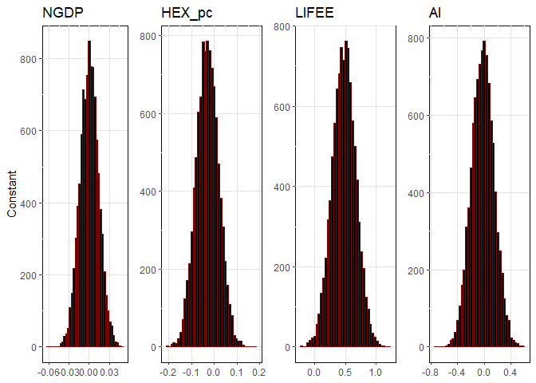<!-- --><!-- -->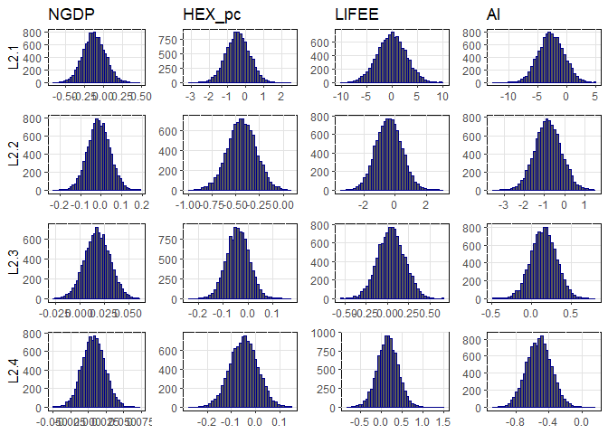<!-- -->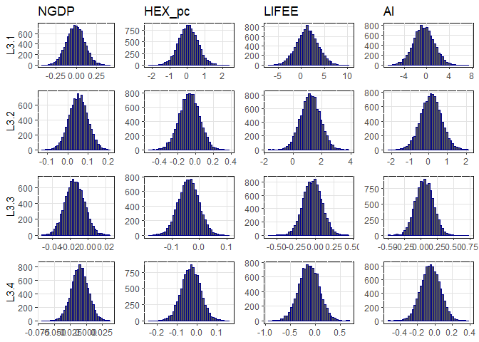<!-- -->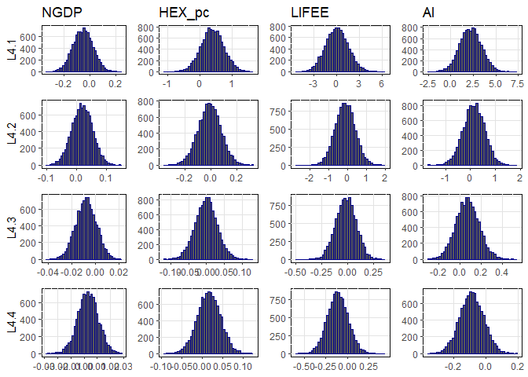<!-- -->

``` r
# where the mean and variances for this distributions are stored in the objects, bvar_obj$alpha_pt_mean and bvar_obj$alpha_pt_var. 
```

And then the impulse response functions could be plotted as follows:

To generate forecasts for each of the variables then we proceed as
follows, where shocks indicates that we would like to incorporate the
effect of the shocks in estimation. The amount of back_data refers to
the amount of observations to include in the graph prior to the initial
forecasting point.

``` r
forecast(bvar_obj, shocks = TRUE, var_names = colnames(dat)[-1], 
    back_data = 12, save = FALSE)
```

<!-- -->

Note that the forecasts are future estimates of the trend in the
process, and we are no longer forecasting time taken to return to trend.
The specific values for the forecasts of the individual variables can be
extracted from the object by amending the object to:

``` r
predict <- forecast(bvar_obj, shocks = TRUE, var_names = colnames(dat)[-1], 
    save = TRUE)
```

################################################# 

``` r
#


bvar_data <- data.matrix(df[,2:5])

#

coef_prior <- c(0.9,0.9,0.9)
HP_1 <- 1/2
HP_3 <- 1
gamma <- 4

bvar_obj <- new(bvarcnw)

#
# Different p

# p = 1


bvar_obj$build(bvar_data,TRUE,1)
bvar_obj$prior(coef_prior,HP_1,HP_3,gamma)
bvar_obj$gibbs(10000)


IRF.Rcpp_bvarm(bvar_obj,20,var_names=colnames(bvar_data),save=FALSE)
```

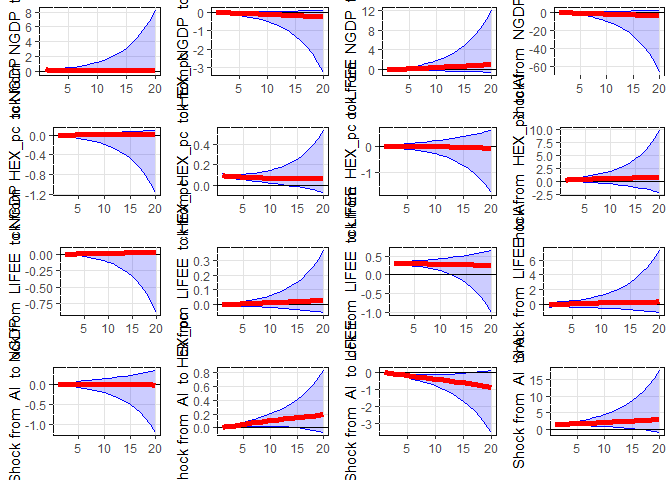<!-- -->

``` r
plot(bvar_obj,var_names=colnames(bvar_data),save=FALSE)
```

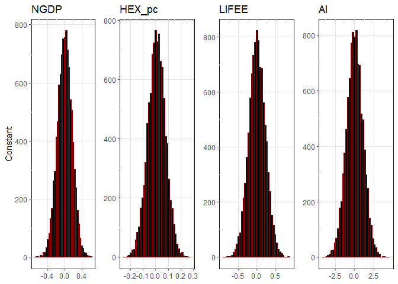<!-- -->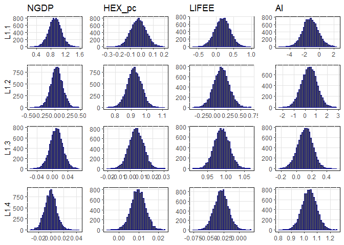<!-- -->

``` r
forecast(bvar_obj,shocks=TRUE,var_names=colnames(bvar_data),back_data=10,save=FALSE)
```

<!-- -->

``` r
FEVD.Rcpp_bvarm(bvar_obj,20,var_names=colnames(bvar_data),save=FALSE)
```

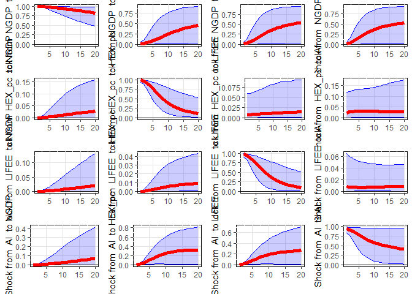<!-- -->

``` r
# p = 2

bvar_obj$reset_draws()
bvar_obj$build(bvar_data,TRUE,2)
bvar_obj$prior(coef_prior,HP_1,HP_3,gamma)
bvar_obj$gibbs(10000)

IRF.Rcpp_bvarm(bvar_obj,20,var_names=colnames(bvar_data),save=FALSE)
```

<!-- -->

``` r
plot(bvar_obj,var_names=colnames(bvar_data),save=FALSE)
```

<!-- -->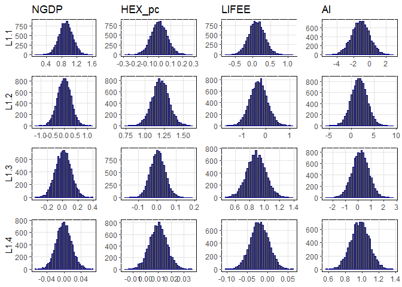<!-- -->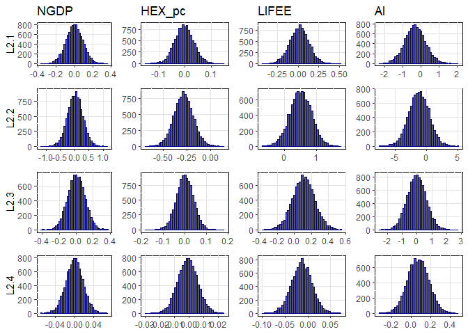<!-- -->

``` r
forecast(bvar_obj,shocks=TRUE,var_names=colnames(bvar_data),back_data=10,save=FALSE)
```

<!-- -->

``` r
# p = 3

bvar_obj$reset_draws()
bvar_obj$build(bvar_data,TRUE,3)
bvar_obj$prior(coef_prior,HP_1,HP_3,gamma)
bvar_obj$gibbs(10000)

IRF.Rcpp_bvarm(bvar_obj,20,var_names=colnames(bvar_data),save=FALSE)
```

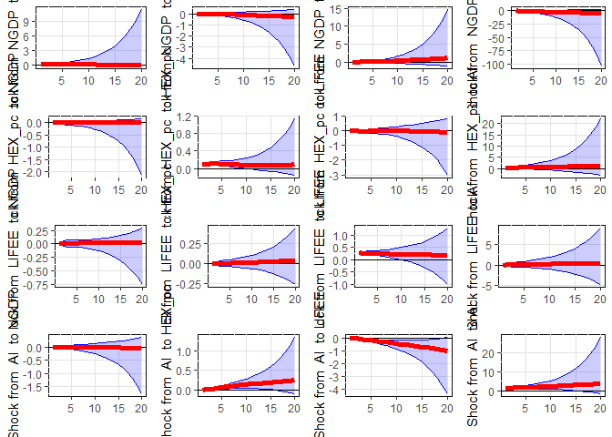<!-- -->

``` r
plot(bvar_obj,var_names=colnames(bvar_data),save=FALSE)
```

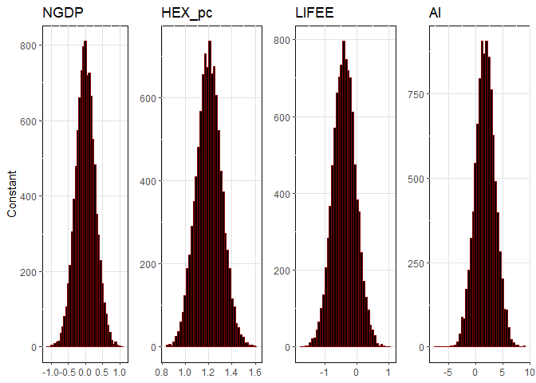<!-- -->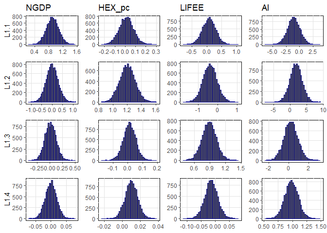<!-- --><!-- -->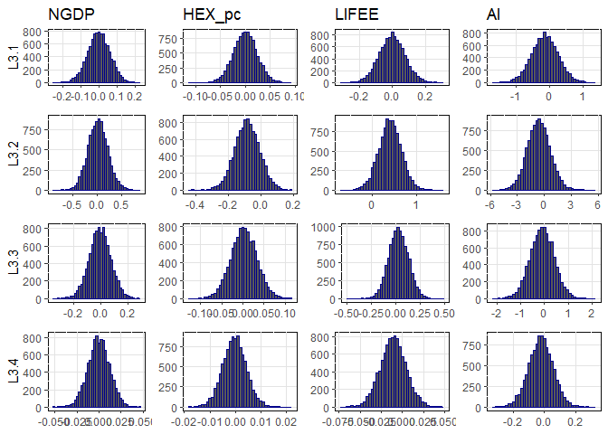<!-- -->

``` r
forecast(bvar_obj,shocks=TRUE,var_names=colnames(bvar_data),back_data=10,save=FALSE)
```

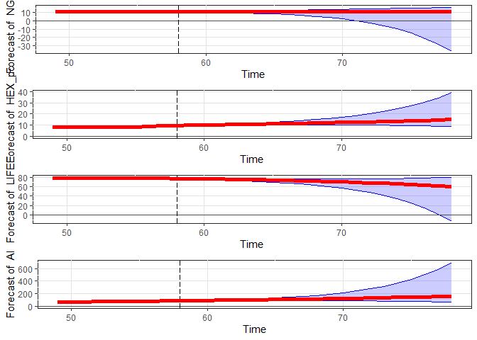<!-- -->

``` r
# p = 4

bvar_obj$reset_draws()
bvar_obj$build(bvar_data,TRUE,4)
bvar_obj$prior(coef_prior,HP_1,HP_3,gamma)
bvar_obj$gibbs(10000)

IRF.Rcpp_bvarm(bvar_obj,20,var_names=colnames(bvar_data),save=FALSE)
```

<!-- -->

``` r
plot(bvar_obj,var_names=colnames(bvar_data),save=FALSE)
```

<!-- -->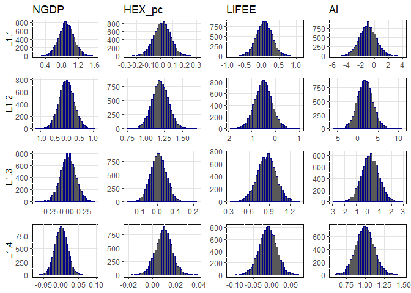<!-- --><!-- --><!-- --><!-- -->

``` r
forecast(bvar_obj,shocks=TRUE,var_names=colnames(bvar_data),back_data=10,save=FALSE)
```

<!-- -->

``` r
#
#END
```
